# Wolf Pack Zeal fork: showcase

Documents only. This branch has no code changes: it is where the fork's changes to
[Zeal](https://github.com/CoastalRedwood/Zeal) are explained, illustrated and made easy to point at. Each change has a
short text (what, why, how, how tested), test cases, preview images, and a poster and PR header banner made from one
template.

**Try the changes:** install the combined test build,
[test-all-build](https://github.com/davehess/Zeal/releases/tag/test-all-build). It merges every pushed branch below
(GitHub Actions build passed at `59bbfca`); Zeal's options window shows the build as `testall-59bbfca`. The three local
drafts (main assist, mez and slow keys, auto raid lead) and the guild icon refresh are **not** in it yet.

**Status words:** `draft` means not yet filed upstream, `filed` means a pull request is open, `merged` means it shipped.
Where something is not compiled or not tested in game, its text says so.

## Changes

The table is generated by `tools/render-posters.js` from the JSON files in `posters/`: do not edit between the markers.

<!-- index:start -->
| Banner | Change | Status | PR | Build | Tests |
|---|---|---|---|---|---|
| [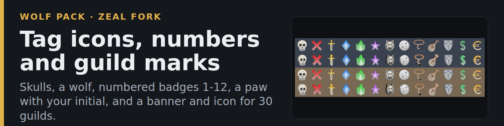](posters/tag-shapes.png) | **[Tag icons, numbers and guild marks](tag-shapes/README.md)** Skulls, a wolf, numbered badges 1-12, a paw with your initial, and a banner and icon for 30 guilds. | draft `tag-shapes` |  | [test-all](https://github.com/davehess/Zeal/releases/tag/test-all-build) | [cases](tag-shapes/TEST-CASES.md) |
| [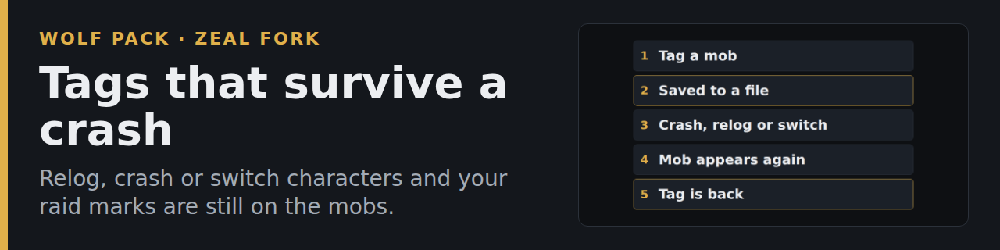](posters/tag-persistence.png) | **[Tags that survive a crash](tag-persistence/README.md)** Relog, crash or switch characters and your raid marks are still on the mobs. | draft `tag-persistence` |  | [test-all](https://github.com/davehess/Zeal/releases/tag/test-all-build) | [cases](tag-persistence/TEST-CASES.md) |
| [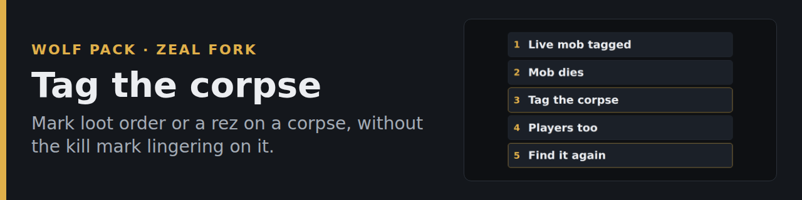](posters/tag-corpses.png) | **[Tag the corpse](tag-corpses/README.md)** Mark loot order or a rez on a corpse, without the kill mark lingering on it. | draft `tag-corpses` |  | [test-all](https://github.com/davehess/Zeal/releases/tag/test-all-build) | [cases](tag-corpses/TEST-CASES.md) |
| [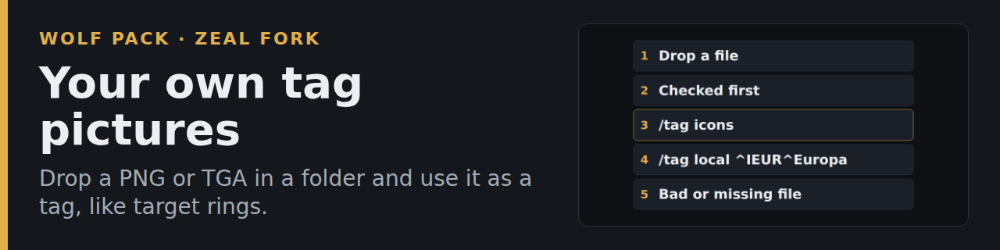](posters/tag-icon-files.png) | **[Your own tag pictures](tag-icon-files/README.md)** Drop a PNG or TGA in a folder and use it as a tag, like target rings. | draft `tag-icon-files` |  | [test-all](https://github.com/davehess/Zeal/releases/tag/test-all-build) | [cases](tag-icon-files/TEST-CASES.md) |
| [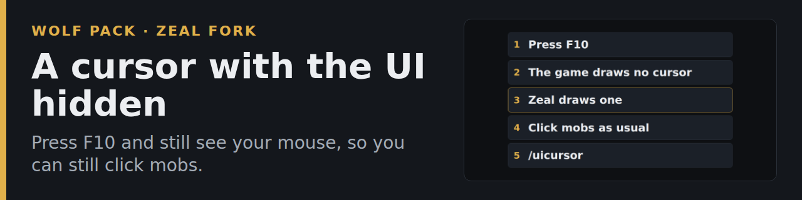](posters/hide-ui-cursor.png) | **[A cursor with the UI hidden](hide-ui-cursor/README.md)** Press F10 and still see your mouse, so you can still click mobs. | draft `hide-ui-cursor` |  | [test-all](https://github.com/davehess/Zeal/releases/tag/test-all-build) | [cases](hide-ui-cursor/TEST-CASES.md) |
| [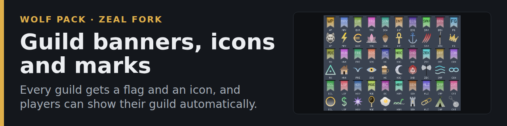](posters/guild-emblems.png) | **[Guild banners, icons and marks](guild-emblems/README.md)** Every guild gets a flag and an icon, and players can show their guild automatically. | draft `tag-shapes` |  | [test-all](https://github.com/davehess/Zeal/releases/tag/test-all-build) | [cases](guild-emblems/TEST-CASES.md) |
| [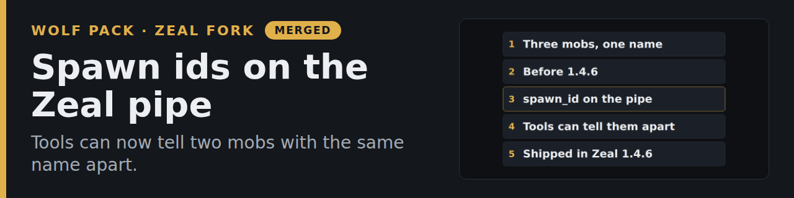](posters/spawn-id.png) | **[Spawn ids on the Zeal pipe](spawn-id/README.md)** Tools can now tell two mobs with the same name apart. | merged `merged upstream (1.4.6)` | [CoastalRedwood/Zeal/pull/229](https://github.com/CoastalRedwood/Zeal/pull/229) | [test-all](https://github.com/davehess/Zeal/releases/tag/test-all-build) | [cases](spawn-id/TEST-CASES.md) |
| [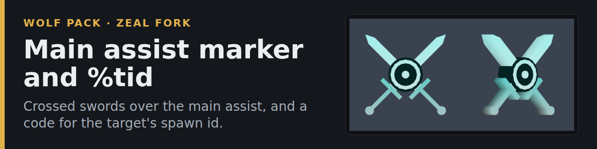](posters/main-assist.png) | **[Main assist marker and %tid](main-assist/README.md)** Crossed swords over the main assist, and a code for the target's spawn id. | draft `ma-draft` |  | [test-all](https://github.com/davehess/Zeal/releases/tag/test-all-build) | [cases](main-assist/TEST-CASES.md) |
| [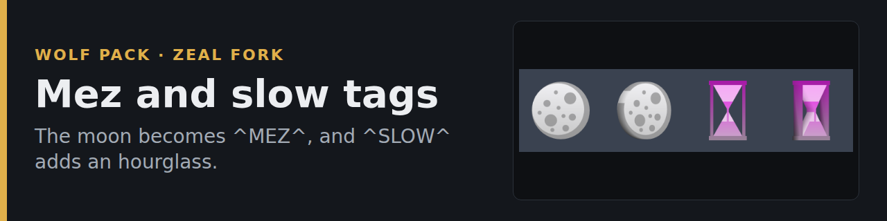](posters/mez-slow-keys.png) | **[Mez and slow tags](mez-slow-keys/README.md)** The moon becomes ^MEZ^, and ^SLOW^ adds an hourglass. | draft `ma-draft` |  | [test-all](https://github.com/davehess/Zeal/releases/tag/test-all-build) | [cases](mez-slow-keys/TEST-CASES.md) |
| [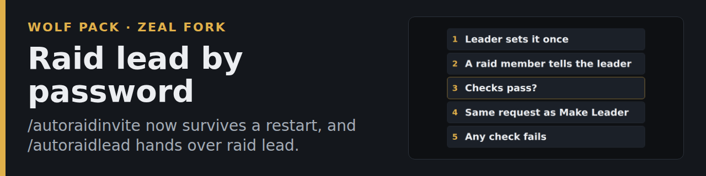](posters/auto-raid-lead.png) | **[Raid lead by password](auto-raid-lead/README.md)** /autoraidinvite now survives a restart, and /autoraidlead hands over raid lead. | draft `raidlead-draft` |  | [test-all](https://github.com/davehess/Zeal/releases/tag/test-all-build) | [cases](auto-raid-lead/TEST-CASES.md) |
| [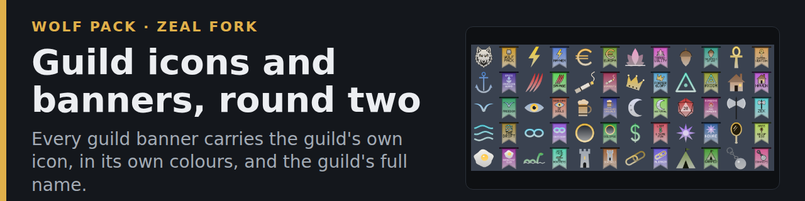](posters/guild-icon-refresh.png) | **[Guild icons and banners, round two](guild-icon-refresh/README.md)** Every guild banner carries the guild's own icon, in its own colours, and the guild's full name. | draft `guildicon-draft` |  | [test-all](https://github.com/davehess/Zeal/releases/tag/test-all-build) | [cases](guild-icon-refresh/TEST-CASES.md) |
<!-- index:end -->

## Folders

- `<change>/README.md`: the post (What, Why, How, How tested) with its banner, and the preview image or diagram.
- `<change>/TEST-CASES.md`: numbered cases with a pass/fail box each.
- `posters/`: `<change>.png` (1200x675 poster), `<change>-banner.png` (1280x320 header for a pull request), the JSON each
  is made from, and how to make a new one ([posters/README.md](posters/README.md)).
- `tools/`: the template and the script that renders the posters, banners and diagrams.

A diagram is marked "not an in-game screenshot" on its face. The pictures of shapes are rendered off the game from the real
mesh code, not captured in game.
