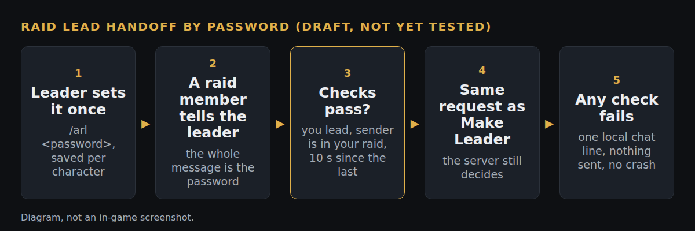

# Auto raid lead, and `/autoraidinvite` that survives a restart

*Local draft branch `raidlead-draft` on our fork (`b15b8a2`, on top of `ma-draft`). Status: draft, not pushed, not compiled. Needs a two-person raid test before anyone relies on it.*

**What**
- `/autoraidinvite` (`/ari`) is now saved per character, so it no longer clears when the client restarts.
- New `/autoraidlead <password>` (`/arl`): when you are the raid leader, a tell from a raid member that is exactly the password hands that member raid lead. `/arl give <name>` does it by hand.

**Why**
Passing raid lead in a hurry (the leader has to leave, or the officer on duty changes) should not mean digging through the raid window. And the old `/ari` built a pattern from the password, so a password with punctuation could misbehave.

**How**
Both passwords live in `zeal.ini` under `AutoRaidInvite` and `AutoRaidLead`. A tell matches only when the whole message equals the password (plain, case-sensitive). The handoff sends the same request the raid window's Make Leader button sends, and the server still decides. Safety rules: you must be raid leader, the sender must be in your raid, one handoff per 10 seconds, and every refusal is one local chat line with nothing sent. A member with no password can tell `raidlead` and the leader gets a prompt to run `/arl give`. The password is stored in plain text in `zeal.ini`, so use a throwaway word. The pipe announces `ARI set <password>` or `ARL on`, never the raid lead password.

**How tested**
- Honest status: not compiled and not run in game; reviewed by reading only. The packet layout was built from the server source and must be proven in a two-person raid.
- Open question for the maintainers: Quarm's rules on automation. This acts on a tell the way `/autoraidinvite` already does, but a written view would help.

**Try it:** not in the fork's test-all build yet (https://github.com/davehess/Zeal/releases/tag/test-all-build). It needs a build of `raidlead-draft`.

---
[Test cases](TEST-CASES.md) · [Poster](../posters/auto-raid-lead.png) · [All changes](../README.md)
