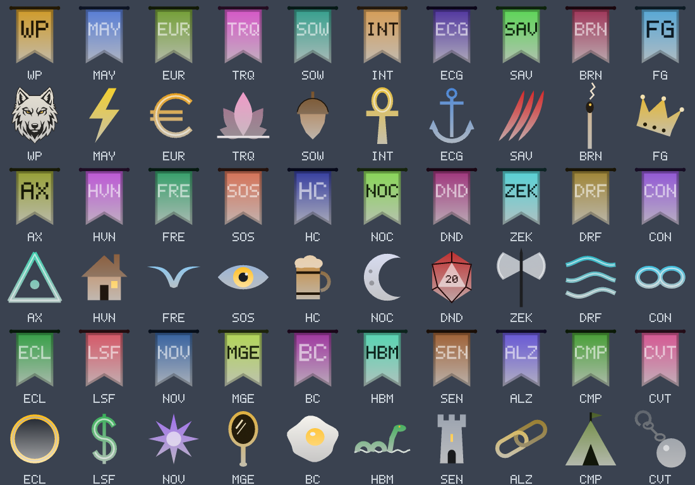

# Guild banners, guild icons, and optional automatic guild marks

*Part of the `tag-shapes` branch on our fork (`c2a5333` for the banners and icons, `f777d81` for the automatic marks), based on Zeal 1.4.8. Status: pushed, not yet filed upstream.*

**What**
Every guild on our list gets a banner (`^B<code>^`, a swallowtail flag with its code on it) and an icon (`^I<code>^`), 30 guilds in all. A new option, `/tag guildmarks auto`, shows each nearby player's own guild icon over their head with nobody having to tag them.

**Why**
Raids mix several guilds, and "who is that, and who are they with" comes up constantly. A mark that appears by itself answers it at a glance, and anyone who prefers a clean screen can turn it off.

**How**
A table of guilds (code and colour) drives both keys, and `/tag guilds` lists the codes. The codes are ours and one table row each to change. The automatic mode reads the guild the client already knows, matches it to the table by letters and digits, and draws on your screen only. It skips /anon and /roleplay players, anyone beyond 150 units, and guilds not in the table. `/tag guildmarks off | tagged | auto`: the default is `tagged`, so nothing changes until someone opts in, and `off` also hides marks other raiders tagged. If a picture file for that guild exists (see the tag pictures change) it is used instead.

**How tested**
- Off the game with g++: every banner and icon mesh passes the strip check, and the sheet above is rendered from the real C++ meshes.
- In game, 2026-09-26: all 30 guild icons drew correctly, including over other guilds' players. Banners were not in those screenshots.
- The fork's GitHub build compiles the automatic marks (test-all, 59bbfca, passed), but they have not been run in game. Twelve checks are written in [`TEST-CASES.md`](TEST-CASES.md), including frame rate in a crowd.

**Try it:** the fork's test-all build, https://github.com/davehess/Zeal/releases/tag/test-all-build, then `/tag guildmarks auto` near other guilds.

---
[Test cases](TEST-CASES.md) · [Poster](../posters/guild-emblems.png) · [All changes](../README.md)
