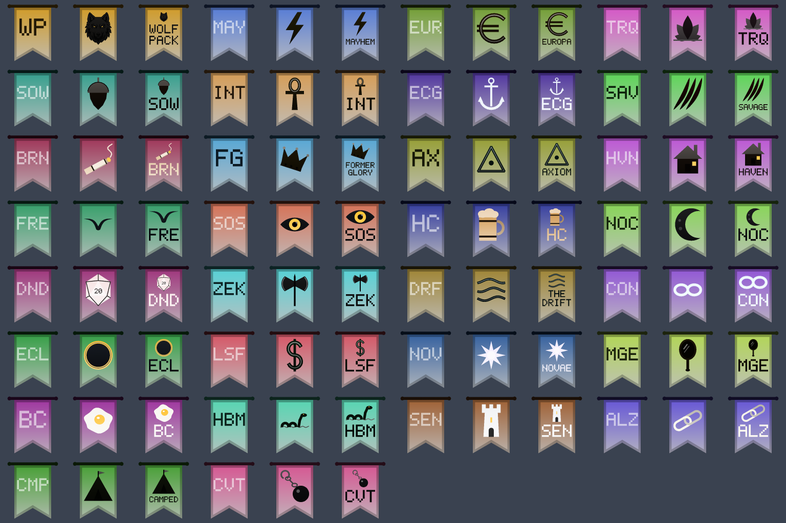

# Guild icons and banners, round two

*Fork branch `guildicon-draft` (`bbd5fe0`, local, stacked on `raidlead-draft`). Status: draft, not compiled with Visual Studio yet.*

**What**
Guild banners (`^B<code>^`) carry the guild's own logo instead of three letters. The logo is that guild's icon
(`^I<code>^`) drawing. One setting switches to logo plus the guild's name under it, where the name fits. The Burnouts
icon is now a lit rolled cigarette instead of a burning match.

**Why**
At raid distance a picture reads faster than a three-letter code, and guilds asked for marks that look like their own
logos. The flag keeps the guild's colour, so colour still tells guilds apart.

**How**
- The logo is drawn into the flag's field above the swallowtail notch, on the existing tag mesh path. No textures.
- The logo uses the guild's icon colour when it contrasts with the flag by at least 3:1 (the WCAG ratio), else a
  near-white or near-black tint of it. 27 of 30 guilds get a tint. Four new mesh tones carry the logo colour, so each
  logo keeps its own highlights and shading.
- The flag colour is unchanged, so the startup check that every guild colour is unique still holds.
- Banners grow from at most 526 vertices to 1,526 (2,226 with names). The vertex buffer is already sized to hold every
  icon at once, so nothing new is allocated per frame.
- With names on (`kBannerStyle`), 8 names fit on one line and 3 on two lines. The other 19 flags show the code under
  the logo.

**How tested**
- Every banner and the cigarette were rendered off the game from the real meshes (the image above).
- `tag_shapes.cpp` compiles cleanly with `g++ -Wall -Wextra`.
- `tag_arrows.cpp` (Direct3D) is not compiled yet, and nothing has run in game. Cases are in [`TEST-CASES.md`](TEST-CASES.md).

**Try it:** not in the fork's test-all build yet (https://github.com/davehess/Zeal/releases/tag/test-all-build).

---
[Test cases](TEST-CASES.md) · [Poster](../posters/guild-icon-refresh.png) · [All changes](../README.md)
