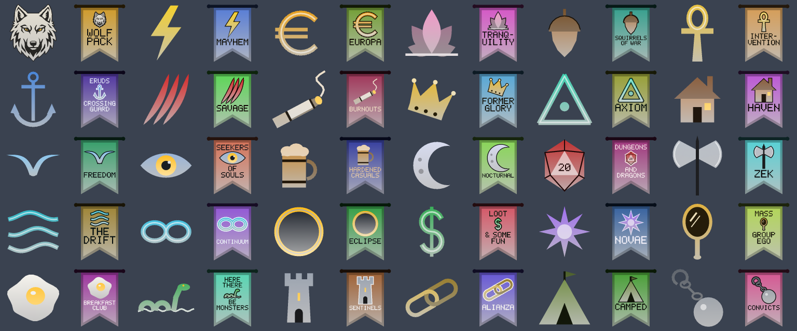

# Guild icons and banners, round two

*Fork branch `guildicon-draft` (`dca0b85`, on `ma-draft`). Status: draft; in the test-all build, compiled by GitHub on 2026-10-10, not yet run in game.*

**What**
Guild banners (`^F<code>^`) carry the guild's own icon and its full name instead of three letters. The icon on the
flag is the same drawing, in the same colours, as that guild's `^I<code>^` icon. Long names sit above and below the
icon ("HERE / THERE", serpent, "BE / MONSTERS"). The Burnouts icon is now a lit rolled cigarette instead of a match.

**Why**
At raid distance a picture and a name read faster than a three-letter code, and guilds asked for marks that look like
their own. The flag keeps the guild's colour, so colour still tells guilds apart.

**How**
- The icon is drawn into the flag's field on the existing tag mesh path, with its own colours and shading. No textures.
- Where the icon's main colour is within 3:1 (the WCAG ratio) of the flag, a thin dark or light rim is drawn behind
  it, so it stays readable without being recoloured. 26 of 30 guilds get a rim.
- The name uses its own contrast-checked colour. Each guild's line breaks come from a small table, with a hyphenated
  split for the longest name (INTER- / VENTION); Tranquility uses its short name, TRANQ.
- The flag colour is unchanged, so the startup check that every guild colour is unique still holds.
- The largest banner is about 3,700 vertices (The Drift). Meshes are built once and the vertex buffer is sized to
  hold every icon, so nothing new is allocated per frame. A one-line setting (`kBannerStyle`) switches back to logo
  only or to the old code.

**How tested**
- Every banner and the cigarette were rendered off the game from the real meshes, each beside its icon (above).
- `tag_shapes.cpp` compiles cleanly with `g++ -Wall -Wextra`.
- The whole fork, `tag_arrows.cpp` (Direct3D) included, compiled in the GitHub build of test-all (`3c4766c`); nothing has run in game yet. Cases are in [`TEST-CASES.md`](TEST-CASES.md).

**Try it:** in the fork's test-all build (https://github.com/davehess/Zeal/releases/tag/test-all-build), `3c4766c` or later.

---
[Test cases](TEST-CASES.md) · [Poster](../posters/guild-icon-refresh.png) · [All changes](../README.md)
