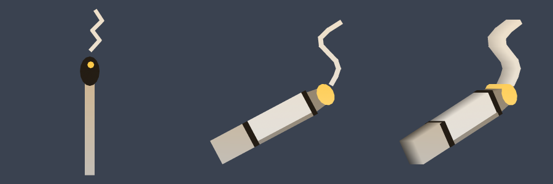

# Guild icons and banners, round two (placeholder)

*Work in progress on the local branch `guildicon-draft` on our fork (last commit `b9f0cff`, with uncommitted changes in the working copy). Status: draft. This post is a placeholder to be filled in when the branch is committed and built.*

**What**
A second pass on the guild marks: banners that carry the guild's logo and name, and icons redrawn to be more recognisable. The first finished piece is the Burnouts icon, a lit rolled cigarette in place of the burning match.

**Why**
The first guild marks were built quickly from simple shapes so every guild had something. Guilds have since asked for marks that look like their own logos, and a banner reads better with a name on it than with only a code.

**How**
Same approach as the first round: flat parts built into the existing tag mesh path, no textures. The banner's logo parts take a logo colour that is contrast-checked against the flag, shaded toward white on a light logo and toward black on a dark one. Guild colours are kept, so the unique-colour check still holds. Details are to be written when the branch is final.

**How tested**
- Not yet tested. Nothing in this branch is compiled with Visual Studio or run in game.
- The cigarette icon was previewed off the game from the real mesh. Test cases are in [`TEST-CASES.md`](TEST-CASES.md) and will be firmed up with the final list of changed guilds.

**Try it:** not in the fork's test-all build yet (https://github.com/davehess/Zeal/releases/tag/test-all-build). Waiting on the branch.

---
[Test cases](TEST-CASES.md) · [Poster](../posters/guild-icon-refresh.png) · [All changes](../README.md)
