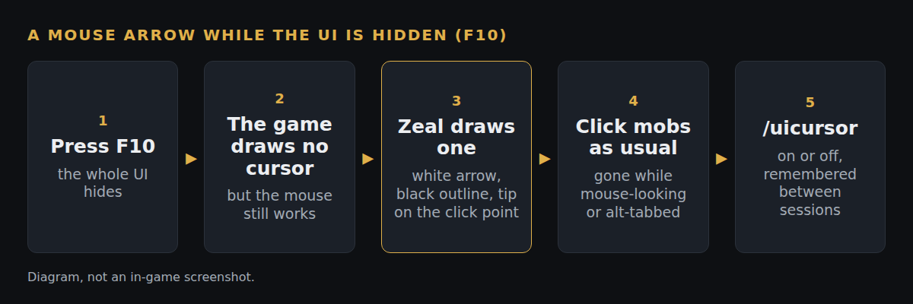

# Show a mouse cursor while the UI is hidden (F10)

*Branch `hide-ui-cursor` on our fork (`2433493`), based on Zeal 1.4.8. Status: pushed, not yet filed upstream.*

**What**
When you press F10 to hide the UI, you still see a mouse arrow. It is a white arrow with a black outline, tip on the point you click.

**Why**
F10 hides the UI and the game stops drawing its mouse cursor with it, but the mouse still works and you still need it to click mobs in the world. Nothing else can bring it back: the game draws the cursor as part of the UI, and the newer eqw.dll blanks the Windows cursor over the game window.

**How**
A small drawing step runs with Zeal's UI render callback. It draws only when the setting is on, you are in game, the UI is hidden, you are not holding the right button to look around, and EverQuest is the foreground window. It reads the game's own mouse position, scales the arrow with screen height (20 pixels tall at 1080p) and saves and restores the render state like Zeal's other overlays. The setting is `ShowCursorWithUiHidden` in `[Zeal]`, on by default, and `/uicursor` toggles it (`/uicursor on` or `off` sets it). 201 lines added over 7 files.

**How tested**
- The fork's GitHub build compiles it (test-all, 59bbfca, includes this change and passed). Nobody on our side has MSVC on the machine that wrote it.
- clang-format with Zeal's style reports nothing.
- Not yet run in game. Two things we are watching for: whether the game keeps updating the mouse position while the UI is hidden (if not, the arrow sticks in a corner), and whether the arrow draws above the world instead of under it. The nine-step in-game plan is in [`TEST-CASES.md`](TEST-CASES.md).

**Try it:** the fork's test-all build, https://github.com/davehess/Zeal/releases/tag/test-all-build, then press F10.

---
[Test cases](TEST-CASES.md) · [Poster](../posters/hide-ui-cursor.png) · [All changes](../README.md)
