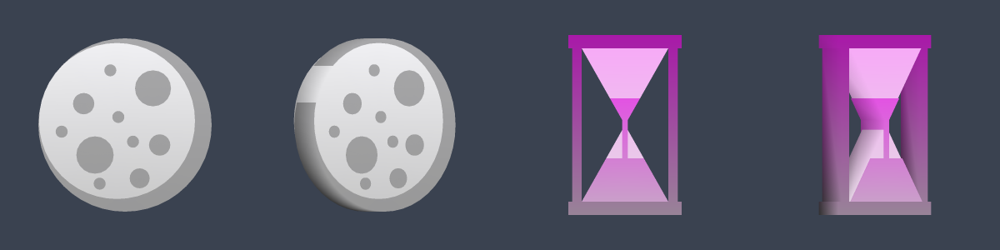

# Mez and slow tags: the moon is `^MEZ^`, plus a `^SLOW^` hourglass

*Fork branch `ma-draft` (`116d3ed`). Status: draft; in the test-all build, compiled by GitHub, not yet run in game. It changes a key from the tag shapes change, so it should land with or after it.*

**What**
The moon marker moves from `^M^` to `^MEZ^`, and a single `^M^` no longer picks a shape. A new `^SLOW^` shows an hourglass.

**Why**
Mez and slow are the two crowd-control jobs a raid most wants to mark. With the moon on a single letter, any tag starting with M (the main assist marker, `^MA^`, for one) would fall back to the moon on an older client or after a typo. Whole words remove that.

**How**
All multi-letter keys (`WP`, `MA`, `MEZ`, `SLOW`) now live in one table read by both the key reader and the colour lookup, matched exactly in either case and only when closed by a caret. An unlisted `^Mxx^` draws no shape instead of the moon. The hourglass is two glass triangles tip to tip in a frame with sand in the lower half, and has its own colour, added to the startup check that every tag colour is unique. On an older client `^MEZ^` still shows the moon (it reads the M) and `^SLOW^` shows a stop sign (it reads the S).

**How tested**
- Honest status: not compiled with Visual Studio and not run in game. It is not in the test-all build.
- The shape file builds clean with g++ and both meshes were previewed off the game.
- Known breaking point: an existing `^M^` tag stops drawing a moon, so anything that watches for it (our raid tools included) has to learn `^MEZ^`. The cases in [`TEST-CASES.md`](TEST-CASES.md) check the old and new keys side by side.

**Try it:** in the fork's test-all build (https://github.com/davehess/Zeal/releases/tag/test-all-build), `3c4766c` or later.

---
[Test cases](TEST-CASES.md) · [Poster](../posters/mez-slow-keys.png) · [All changes](../README.md)
