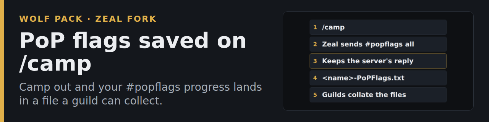
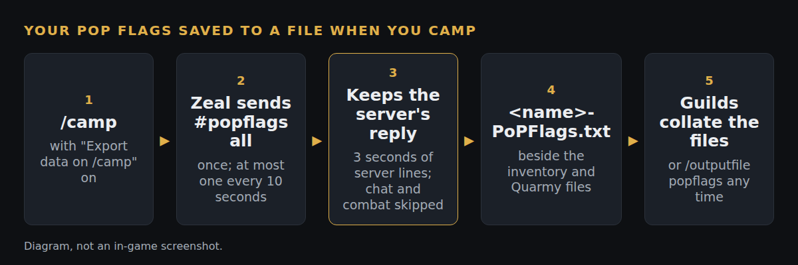

# Save your #popflags output with "Export data on /camp"

*Fork branch `popflags-export` (`195433e`), based on Zeal 1.4.8. Status: draft; in the test-all build (`ab95a91`), not yet run in game.*

This answers the suggestion thread 'Zeal "Export data on /camp" option to include a full #POPFLAGS output?'.

**What**
With "Export data on /camp" on, camping now also saves your Planes of Power flag progress to `<name>-PoPFlags.txt`, next to the inventory, spellbook and Quarmy files. `/outputfile popflags` does the same on demand.

**Why**
Guilds collate PoP flags by hand in spreadsheets. The server already prints each character's flags with `#popflags`, but only into chat, where it scrolls away. A file per character, written at the end of the night, can be collected and merged by a script.

**How**
When you camp, Zeal sends `#popflags all` to the server once. For the next 3 seconds it keeps the server-coloured chat lines that arrive (player chat, combat and NPC speech are skipped), then writes them under three header lines (character, timestamp, command) and a `---` line. The reply still shows in your chat. Nothing waits on the server, so the game never stalls. If the server sends nothing, no file is written. Requests are limited to one per 10 seconds, and are skipped when the camp is not going ahead. About 95 lines in `outputfile.cpp` and `outputfile.h`, plus README and CHANGELOG. No new setting, but players who already have "Export data on /camp" ticked will start sending `#popflags all` when they camp.

We have not seen the real `#popflags` text. The file keeps the reply line for line so it stays correct whatever the server prints.

**How tested**
- The capture, the once-per-10-seconds rule, the empty-reply case and the file layout ran against a stand-in on Linux.
- clang-format with Zeal's style is clean on the new lines.
- The whole fork is built by GitHub from test-all; nothing has run in game yet. The in-game plan is in [`TEST-CASES.md`](TEST-CASES.md). The main thing to confirm is that the server's reply arrives in the small server colours Zeal keeps.

**Try it:** in the fork's test-all build (https://github.com/davehess/Zeal/releases/tag/test-all-build), `ab95a91` or later, then `/outputfile popflags`.

**Pull request:** _link added when it is filed._

**Testing evidence:** _added after the in-game test run._

---
[Test cases](TEST-CASES.md) · [Poster](../posters/popflags-export.png) · [All changes](../README.md)
