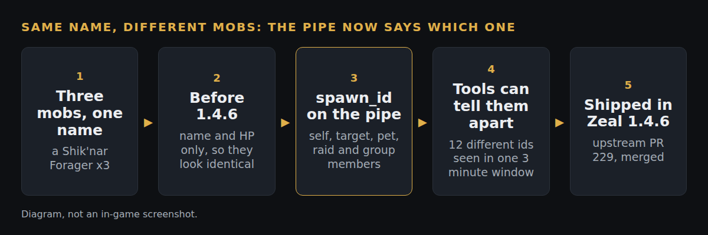

# Spawn ids on the named pipe (merged, shipped in Zeal 1.4.6)

*Upstream pull request 229, merged. This is a status note rather than a new request, and it says what the change made possible.*

**What**
The Zeal pipe now carries the spawn id for you, your target, your pet, and every raid and group member (keys `spawn_id`, `target_id`, `pet_id`).

**Why**
Tools reading the pipe could not tell two mobs with the same name apart, so a debuff or a kill could be credited to the wrong one. An existing issue asked for exactly this, and a second tool author hit the same wall.

**How**
The pipe already held the entity pointer for those rows, so the id is one extra field read from it. The keys are optional: with no target or no pet they are left out rather than set to a placeholder. A live run on Project Quarm found one bug in the first version (a pet id of -1 with no pet) and the guard was changed to "greater than zero" before it merged.

**How tested**
- Built with Visual Studio 2022 (Release, x86): 0 warnings, 0 errors, 32-bit output, the three keys present in the compiled file.
- Run live on Project Quarm with a small pipe reader: that run found the pet id bug above.
- Since release, on real data: twelve different spawn ids for one mob name inside a 3 minute window, and 27 debuff landings separated cleanly. Adoption is a fleet question now: about 11 of 19 uploading raiders were sending ids three days after release.

**Try it:** every build includes it from 1.4.6, including the fork's test-all build, https://github.com/davehess/Zeal/releases/tag/test-all-build.

---
[Test cases](TEST-CASES.md) · [Poster](../posters/spawn-id.png) · [All changes](../README.md)
