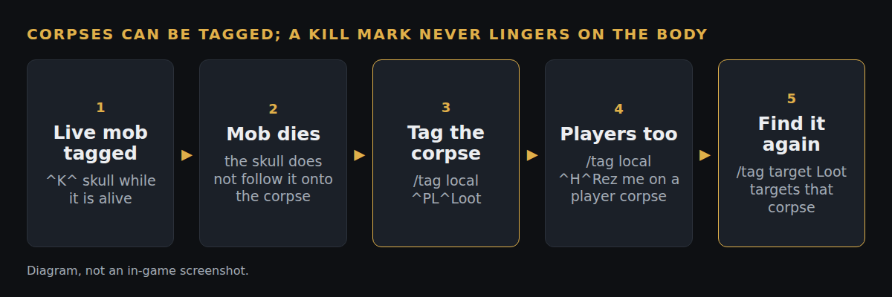

# Allow tags on corpses

*Branch `tag-corpses` on our fork (`7f7c824`), based on Zeal 1.4.8. Status: pushed, not yet filed upstream.*

**What**
You can tag NPC corpses and player corpses, for loot order or a "rez me" mark. A marker put on a mob while it lived, such as a skull, does not carry over onto the body it leaves.

**Why**
Tagging a corpse answered "Must have a valid target with a visible nameplate to tag". That was never an engine limit: five deliberate checks in the nameplate code refused it. A kill marker should not linger on the corpse it made, but a mark set on the corpse itself should show.

**How**
Corpses now take tag text and the default arrow, and a flag records that a tag was set on the corpse itself. Drawing, the tagged nameplate colour and `/tag target` use a corpse's tag only when that flag is set, so `/tag target Loot` finds a corpse tagged "Loot" but never a body that was tagged "Kill" in life. Live players still take only an explicit shape. 31 lines added, 11 removed, in `nameplate.cpp` and `nameplate.h`, plus one README line.

A target whose model is not drawn (too far away, not loaded) still cannot be tagged, because the tag lives on the entry Zeal keeps for each drawn nameplate. Making that entry early was judged unsafe.

**How tested**
- Tested in game on 2026-10-09 with the fork's test-all build: tagging works on both NPC and player corpses.
- The fork's GitHub build compiles it (test-all, 59bbfca, passed).
- Not yet run in game: the pre-death skull staying off the corpse, `/tag target` on a corpse, and a raid-wide corpse tag seen by a second client. Those steps are in [`TEST-CASES.md`](TEST-CASES.md).

**Try it:** the fork's test-all build, https://github.com/davehess/Zeal/releases/tag/test-all-build, then the "Corpses" section of [`TRY-IN-GAME.md`](../tag-shapes/TRY-IN-GAME.md) (in the `tag-shapes` folder).

---
[Test cases](TEST-CASES.md) · [Poster](../posters/tag-corpses.png) · [All changes](../README.md)
