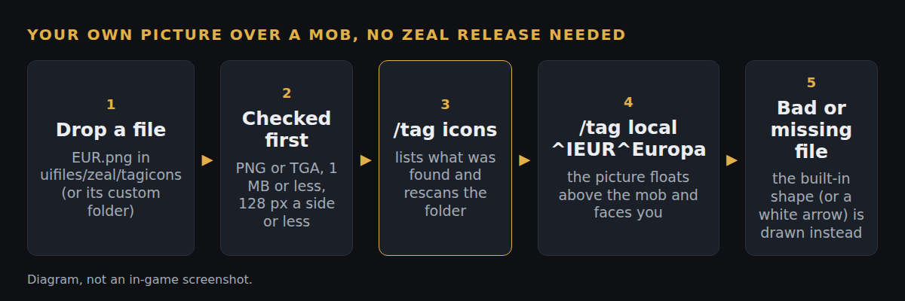

# Tag pictures: use a PNG or TGA from a folder as a tag

*Branch `tag-icon-files` on our fork (`b20331f`), stacked on `tag-shapes`. Status: pushed, not yet filed upstream. Open it after the tag shapes change.*

**What**
Put a PNG or TGA in `uifiles/zeal/tagicons` and `^I<name>^` shows that picture floating over the mob, facing you. Guilds can use their own logo, and a `custom` subfolder keeps a player's own pictures through UI and Zeal updates.

**Why**
After the built-in guild marks, other guilds asked for their own logos, often as painted full-colour artwork that cannot be rebuilt as a flat shape. Pictures work like target ring textures: drop in a file, no code change and no Zeal release per guild.

**How**
A camera-facing textured square is drawn where a shape would be, using the same transform as the 3D nameplate text so it never reads backwards. A file is loaded only after a hand-read header check: PNG or true-colour TGA, at most 1 MB and 128 pixels a side. A bad or missing file falls back to the built-in shape, or a white arrow. A picture beats a built-in guild icon with the same code, and `custom` beats the shipped folder. `/tag icons` lists the pictures and rescans. Tag messages on the wire are unchanged, so another player without the file just sees the built-in mark.

**How tested**
- Off the game with g++, `test/pictures.sh` runs the folder scan, key reader and header check extracted verbatim: precedence, rescan, a missing folder, size limits (including a width of 2^31) and refused formats. Eleven deliberate breaks each make it fail.
- The fork's GitHub build compiles it (test-all, 59bbfca, passed).
- Not yet recorded as run in game: the drawing itself, the orientation card (should never be mirrored or upside down), and whether the game's D3DX supports PNG as well as TGA.

**Try it:** the fork's test-all build, https://github.com/davehess/Zeal/releases/tag/test-all-build, then [`TEST-CASES.md`](TEST-CASES.md).

**Pull request:** _link added when it is filed._

**Testing evidence:** _added after the in-game test run._

---
[Test cases](TEST-CASES.md) · [Poster](../posters/tag-icon-files.png) · [All changes](../README.md)
