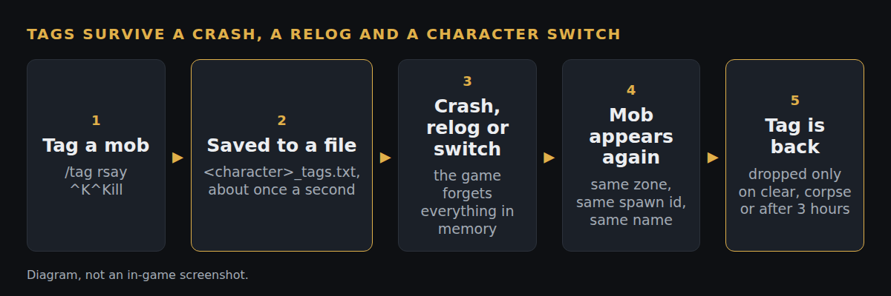

# Keep tags through a crash, relog or character switch

*Branch `tag-persistence` on our fork (`6ab82a9`), based on Zeal 1.4.8. Status: pushed, not yet filed upstream.*

**What**
Your tags come back after a crash, a relog, camping to another character, or zoning out and back. A tagged player keeps the tag too, even though their spawn id changes every time they zone. A tag sent from someone in a different zone no longer lands on a random mob here.

**Why**
Tags only live in memory. A raider who crashes mid-raid returns to untagged mobs while everyone else still sees the marks. Also, spawn ids repeat between zones, so a tag from another zone landed on whatever local mob had that number.

**How**
About once a second the live tags are copied to `<character>_tags.txt` in the EverQuest folder (temp file, then rename). When a mob with the same zone, spawn id and name appears, its tag is restored. A saved tag is dropped when the mob dies, when another name holds that id, on a clear, or three hours after last seen. Players are saved by name instead. A received tag must now also match the target's name. `/tag persist on|off`, on by default. A failed save prints one chat line instead of crashing the game loop.

**How tested**
- Off the game with g++, `test/sync.sh` runs the real save and restore code through a file round trip, a player leaving and returning, zoning together, death and rez, a clear, and the NPC rules. Six deliberate breaks each make it fail.
- The fork's GitHub build compiles it (test-all, 59bbfca, passed).
- Honest history: the first version crashed at launch (the saved-tag list was declared after a setting whose startup callback reads it). That is fixed and written up in the pull request notes.
- The in-game checklist (crash, relog, zoning with a tagged player) is written but has not been signed off on the current build.

**Try it:** the fork's test-all build, https://github.com/davehess/Zeal/releases/tag/test-all-build, then follow [`TEST-CASES.md`](TEST-CASES.md).

**Pull request:** _link added when it is filed._

**Testing evidence:** _added after the in-game test run._

---
[Test cases](TEST-CASES.md) · [Poster](../posters/tag-persistence.png) · [All changes](../README.md)
