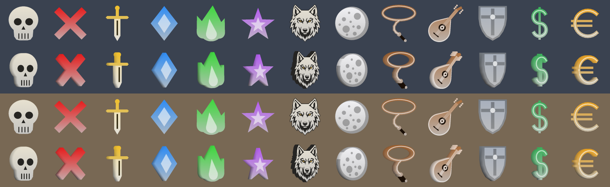

# More tag symbols: icons, numbers, paw initials and guild marks

*Branch `tag-shapes` on our fork, based on Zeal 1.4.8. Status: pushed, not yet filed upstream.*

**What**
`/tag` can show more than the arrow, stop sign and paw. New: a skull, X, sword, diamond, flame, star, moon, lasso, lute, shield, dollar and euro sign, a wolf's head, numbered badges 1 to 12, a paw with a letter or digit on it (a charmer's initial), and a banner and icon for each of 30 guilds.

**Why**
Raid marking needs more distinct symbols than three: kill order, who pulls, who mezzes, who tanks. The upstream maintainer once tried a skull and dropped it because a single flat outline looked wrong.

**How**
Type the key after the caret, for example `/tag local ^K^Kill`, `^7^`, `^PK^`, `^BEUR^`. `/tag guilds` lists the guild codes. Each shape is a few flat parts built into the same coloured triangle path the arrow uses, so no textures and nothing new to render. The wolf is traced from our site artwork. Keys avoid R, O, Y, G, B, W, P and S on purpose, because an older client reads only the first letter and would draw something that contradicts the new mark. Older clients show a plain arrow or only the text, never a wrong symbol.

**How tested**
- Off the game with g++: every mesh passes a strip check, and the key reader is extracted verbatim and run against every key, every guild in both cases, and all 126 tag colours being distinct.
- clang-format with Zeal's own style reports nothing.
- The fork's GitHub build compiles it (test-all, commit 59bbfca, passed).
- In game, 2026-09-26: all 13 symbols, the badges, the lettered paws and every guild icon drew correctly, including over other guilds' players. Guild banners were not in those screenshots, and the newer guild-mark option has not been run in game yet.

**Try it:** install the fork's test-all build, https://github.com/davehess/Zeal/releases/tag/test-all-build, then paste the lines from [`TRY-IN-GAME.md`](TRY-IN-GAME.md).

---
[Test cases](TEST-CASES.md) · [Poster](../posters/tag-shapes.png) · [All changes](../README.md)
